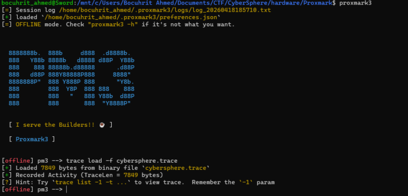
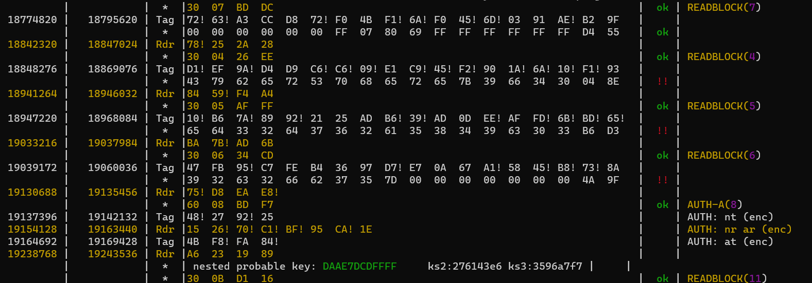
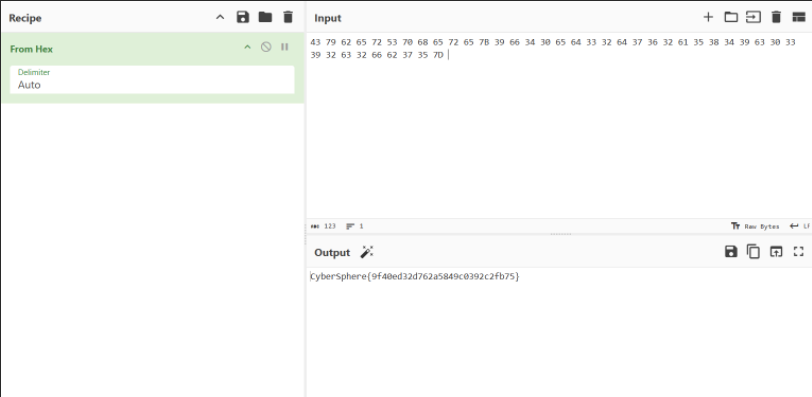

# 📡 CTF Writeup: Echo Nest (Hardware / RF)

**Category:** Hardware / RF Analysis  
**Difficulty:** Intermediate  
**Tools Used:** Proxmark3, `mfkey32` / `mf_nonce_brute`, Hex/ASCII Decoder  
**Target File:** `cybersphere.trace`

## 📝 Challenge Description

> *"Using a Proxmark, we intercepted the RF chatter of an operative tricking a secure pass into giving up its own secrets. With the outer perimeter breached, the card's broken logic is whispering the remaining locks' weaknesses into the air.                Hint : ISO 14443-A "*

## 🎯 Executive Summary

This challenge requires analyzing a captured RF trace of a **MIFARE Classic 1K** card communication. The trace captures an active **Nested Authentication Attack**, where an attacker uses one known default key to exploit the card's flawed Pseudo-Random Number Generator (PRNG) and leak the secret keys for the remaining sectors. By cracking these leaked nonces, we reconstruct the custom keys, decrypt the trace, and extract the hidden flag from the card's memory blocks.

---

## 🛠️ Detailed Solution

### Step 1: Initial Trace Analysis

We are provided with a raw binary trace file: `cybersphere.trace`. Since this is a capture of physical radio signals (ISO 14443-A), we need to load it into the Proxmark3 client in offline mode to parse the packets.



Next, we attempt to parse the trace as MIFARE Classic traffic using the default key dictionary:

```bash
[offline] pm3 --> hf mf list
```

While scanning the output, we notice several standard authentication attempts using a weak default key (`FFFFFFFFFFFF`). However, when the reader attempts to access target sectors, the Proxmark3 client flags an ongoing attack:

```text
Nested authentication detected!
tools/mfc/card_reader/mf_nonce_brute 43795370 db2c3100 1010 fcaf34f1 6ad44a49 1010 a3ac02a 1010 A298F1E1
...
Nested authentication detected!
tools/mfc/card_reader/mf_nonce_brute 43795370 91c32ab8 1011 f8da4f7b f16a716b 0010 cf5bfbe5 0101 9A0BABE8
```

### Step 2: Recovering the Missing Keys (The Nested Attack)

The log indicates that the "operative" (the attacker in our capture) successfully authenticated to a sector using a known key, and then requested authentications to *other* unknown sectors. 

Because the MIFARE Classic's Crypto1 algorithm has a mathematically flawed PRNG, the encrypted challenges (nonces) returned by the card leak information about the unknown keys. The Proxmark3 software handily extracts these nonces for us. 

By running these leaked nonces through a cracking tool (like `mf_nonce_brute` or `mfkey32`), the mathematical operations are reversed, recovering the custom 48-bit keys the card was using. 

*Recovered Custom Keys:*

* `f6a651c5d3f7`
* `daae7dcdffff`

### Step 3: Creating a Custom Key Dictionary

Because the keys securing the flag are custom, the Proxmark3 cannot decrypt the `READBLOCK` payloads natively. We must provide the cracked keys to the client via a dictionary file.

We drop into a standard Linux terminal and generate `mykeys.dic`:

```bash
mykeys.dic
FFFFFFFFFFFF
000000000000
a0a1a2a3a4a5
d3f7d3f7d3f7
f6a651c5d3f7
daae7dcdffff
```

### Step 4: Decrypting the RF Payload

With the keys recovered and the dictionary created, we reload the trace and instruct Proxmark3 to parse the communication using our custom dictionary:

```bash
[offline] pm3 --> trace load -f cybersphere.trace
[offline] pm3 --> hf mf list -f mykeys.dic
```

The output is vastly different now. Armed with the correct keys (`daae7dcdffff` and `f6a651c5d3f7`), Proxmark3 successfully decrypts the MIFARE Classic communication layer. Scrolling through the output, we locate the specific commands where the reader dumped the memory blocks containing the flag.



### Step 5: Flag Reconstruction

The decrypted data blocks are provided in hex format. To reveal the final string, we extract the hex blocks and translate them to ASCII:

* **Block 4:** `43 79 62 65 72 53 70 68 65 72 65 7B 39 66 34 30` ➔ ``
* **Block 5:** `65 64 33 32 64 37 36 32 61 35 38 34 39 63 30 33` ➔ `
* **Block 6:** `39 32 63 32 66 62 37 35 7D 00 00 00 00 00 00 00` ➔ `

Concatenating the strings reveals the final flag.



## Final Flag

`CyberSphere{9f40ed32d762a5849c0392c2fb75}`

---

### 🧠 Takeaways

* Never rely on factory default keys (`FFFFFFFFFFFF`) on MIFARE Classic deployments. Leaving even *one* sector secured with a default key compromises the cryptography of the entire card due to the Nested Authentication vulnerability.
* RF trace captures (`.trace`) contain raw encrypted nonces. They do not store the key in plaintext, meaning the cryptography must be mathematically reversed to interpret the sniffed traffic.
